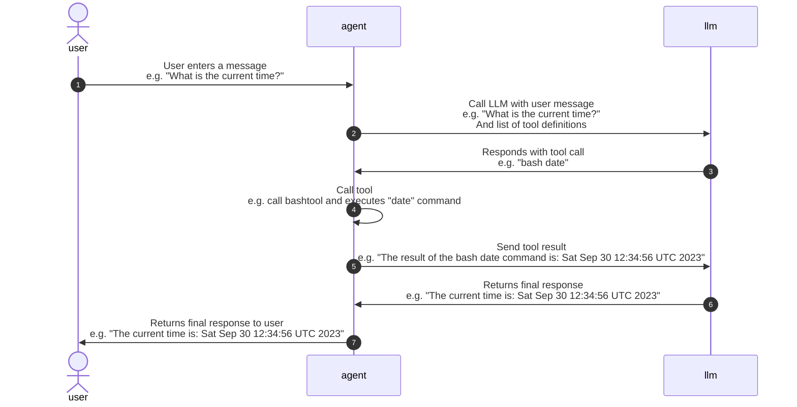

This project demontrates building a simple ai agent with go lang

### Prerequisites
- Go 1.26 or later
- Make to build the application

### To Build
Make is used to build the application
```bash
cd src 
make build
```

This will build the binary in the `bin` directory and copy env-example file

### To Run
- update `env-example` with settings to to your llm model
- rename `env-example` to `.env`
- run the binary
```bash
cd bin
./agent0
```


#### To Run in Non interactive mode
You can also run the agent in non interactive mode by passing a message as an argument
```bash
cd bin
./agent0 -p "What is the current time?"  
```


### How it works


### Project Structure
- `main.go` is the entry point of the application. 
  - It loads environment variables
  - initializes the agent, and starts it.


- `agent` - the agent directory contains the agent implementation. 
  - `config.go` defines the configuration struct and a function to load it from environment variables.

  - `agent.go` defines the agent struct and its methods. 

  - `tool` tools directory contains tools the agent can call
     - each tool implements the `Tool` interface defined in `tools.go`
     - `generic` directory contains a collection of generic tools 

     - Each tool has 3 parts:
        - a function to create an instance of the tool e.g `New<ToolName>`
        - a method to provide tool definition e.g `Defintion()`
        - a method to call the tool e.g `Call(...)`

      - Tools are registered with the agent in `agent.go`
